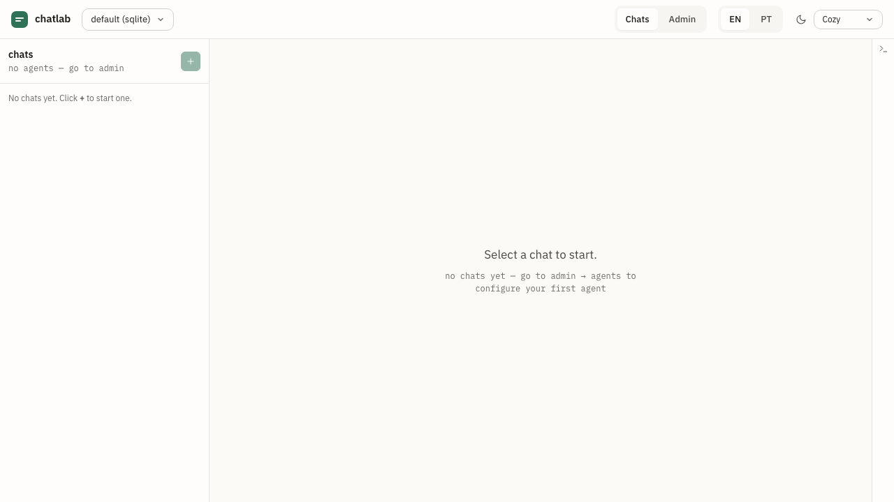

# chatlab

> 🇺🇸 [English](./README.md) · 🇧🇷 Português

> Uma plataforma local de desenvolvimento pra agentes de chat — escolha um provedor, fale com ele, segregue cenários via workspaces, capture feedback pra fine-tuning. Roda no seu laptop, sem cloud, sem teatro de setup.

> ℹ️ Esta página foi traduzida inicialmente com auxílio de IA. Sugestões de melhoria são bem-vindas via PR.

`chatlab` é o que você usa quando está construindo um agente de chat e quer um inner loop apertado: configure um provedor uma vez, abra uma conversa com um agente + tema escolhidos, digite mensagens, veja respostas, avalie, escreva notas, exporte um corpus JSONL quando estiver pronto pra fazer fine-tune.

> Status: **v1.0.0** (lançada em 2026-04-30) — capabilities `0001`–`0006` `Implemented` (workspaces, agents, chats-and-messages, feedback-and-export, media, web-ui); capability `0007-eval-harness` em rascunho pra v1.1. 90 testes passando sob o gate de 80% lines / 80% statements / 80% functions / 65% branches (`vitest.config.ts`).



**Novo por aqui?** Leia o [Guia do usuário](./docs/user-guide/README.md) pra um passo a passo end-to-end com screenshots, ou pule pro [quickstart](./docs/quickstart.md) de 5 minutos abaixo.

---

## Site de documentação

Navegue pelos docs publicados (guia do usuário, capabilities, ADRs, OpenAPI via Redoc) em **[https://jvrmaia.github.io/chatlab/](https://jvrmaia.github.io/chatlab/)** quando GitHub Pages estiver habilitado pra este repo (**Settings → Pages → Build and deployment → GitHub Actions**).

Pré-visualize local da raiz do repo:

```bash
npm install --prefix docs-site   # primeira vez
npm run docs:dev                  # http://localhost:3000/chatlab/
```

Veja [`docs-site/README.md`](./docs-site/README.md) pra comandos específicos do site.

---

## Por quê

Desenvolvimento de agente de chat precisa de algumas coisas que são chatas de configurar:

- Um lugar pra **testar vários provedores LLM** lado-a-lado sem reescrever integrações.
- Um jeito de **manter cenários segregados** — seu workspace "demo do support-bot" não pode vazar no workspace "agente experimental ousado".
- Um jeito de **iterar em prompts** que não exija publicar um novo serviço de agente toda hora.
- Um jeito de **capturar feedback** enquanto testa — cada 👍/👎 + comentário + anotação de conversa alimenta o corpus que você vai usar pra fine-tuning.

Sete provedores vêm out of the box. Seis são clientes LLM (OpenAI, Anthropic, DeepSeek, Gemini, Maritaca, Ollama). O sétimo é **`custom`** — você aponta pro agente **que está construindo**. Esse é o caso de uso headline: o chatlab é a bancada que você deixa aberta enquanto itera no prompt e provedor do seu agente, com a mesma UI que você usaria pra comparar com `gpt-4o`. O estado persiste entre execuções (backends sqlite ou duckdb). Você pode rodar quantos workspaces paralelos quiser e trocar entre eles pela UI.

## Por que chatlab e não …

| Use chatlab quando… | Use **LangSmith** quando… | Use **Promptfoo** quando… | Use **OpenAI Playground** quando… |
| --- | --- | --- | --- |
| Você está **construindo um agente de chat** e quer testá-lo numa bancada que também sabe falar com `gpt-4o`, `claude-sonnet-4-6` ou `llama3` pra comparação. O provider `custom` aponta o chatlab pro seu dev server (qualquer endpoint OpenAI-compat); os outros seis clientes rodam ao lado. Local-first, pronto pra exportar JSONL, sem conta SaaS. | Você está enviando um app LangChain pra produção e precisa de observabilidade + tracing em cloud entre chamadas LLM, retrievers e tools. O chatlab não rastreia chains internos — ele é uma bancada pra superfície de conversa, não pro runtime do LangChain. | Você só precisa de um loop de **regression-eval** (golden set → asserções → score). O Promptfoo é ótimo nesse trabalho. A v1.0 do chatlab não traz eval harness ([0007 está no roadmap da v1.1](./docs/specs/capabilities/0007-eval-harness.md)); use o Promptfoo até lá. | Você quer comparar um único prompt OpenAI entre `gpt-4o` e `o1` interativamente. O Playground é rápido e gratuito pra isso. O wedge do chatlab é multi-provedor + multi-workspace + corpus persistente + seu-próprio-agente — overkill se você vive dentro de um único provedor. |

O wedge: **multi-provedor, multi-workspace, totalmente local, pronto pra exportar JSONL**. Se essas quatro não importam todas pro seu loop, uma das alternativas acima é provavelmente a melhor escolha.

## Rodar local

**Pré-requisitos:** Node.js 22.

```bash
git clone https://github.com/jvrmaia/chatlab.git
cd chatlab
npm install
npm run build
npm start
```

Você vai ver:

```
chatlab listening on http://127.0.0.1:4480
  workspace: default (sqlite)
  data dir : /Users/voce/.chatlab/data
  auth     : permissive (any non-empty bearer)
  retention: 90 days
  ui       : http://127.0.0.1:4480/ui
```

Abra [http://127.0.0.1:4480/ui](http://127.0.0.1:4480/ui) em qualquer browser moderno. Configure um agente em **Admin → Agentes**, depois inicie uma **+ Nova conversa** com um tema. Digite uma mensagem — em alguns segundos o agente responde.

Se você tem um Ollama local rodando, dá pra fazer tudo isso 100% offline (sem precisar de chave de API pro provider `ollama`).

## Rodar os testes

```bash
npm test
```

90 testes Vitest cobrem as capabilities 0001–0006: CRUD do registry de workspaces + ativação, todos os 3 storage adapters (memory/sqlite/duckdb), adapters de provedor de agente (OpenAI-compat + Anthropic), runner de agente por conversa (incluindo workspace-swap-em-andamento), criptografia de chave de API em repouso, sweep de retenção, cada router HTTP, broadcasts do WS gateway. Thresholds de coverage: 80% lines/statements/functions, 65% branches.

## O que ele faz

| Capability | Status | Referência |
| --- | --- | --- |
| Workspaces (UUID + apelido + storage por workspace) | Implemented | [`0001`](./docs/specs/capabilities/0001-workspaces.md) |
| Agents (7 provedores incl. `custom`, chaves mascaradas, criptografadas em repouso, endpoint de probe) | Implemented | [`0002`](./docs/specs/capabilities/0002-agents.md) |
| Chats + mensagens (agente + tema por conversa) | Implemented | [`0003`](./docs/specs/capabilities/0003-chats-and-messages.md) |
| Avaliações de feedback + anotações + export JSONL | Implemented | [`0004`](./docs/specs/capabilities/0004-feedback-and-export.md) |
| Mídia (imagem / áudio / vídeo / documento / figurinha) | Implemented | [`0005`](./docs/specs/capabilities/0005-media.md) |
| UI Web (seletor de workspace, tabs Conversas / Admin) | Implemented | [`0006`](./docs/specs/capabilities/0006-web-ui.md) |

O contrato HTTP completo — cada endpoint, shape de request, shape de response, código de erro — está em [`docs/specs/api/openapi.yaml`](./docs/specs/api/openapi.yaml).

## Layout do projeto

```
src/
  agents/              Adapters de provedor LLM (openai-compat, anthropic) + factory + runner
  core/                Classe Core — donadora do estado global, com storage trocável
  http/                Servidor Express + routers (workspaces, chats, agents, feedback, media)
  lib/                 helpers de id, tempo
  storage/             Interface StorageAdapter + implementações memory / sqlite / duckdb
  types/               types de domínio, agente, feedback, mídia
  ui/                  UI React + Tailwind + Vite no navegador
  workspaces/          WorkspaceRegistry — registry persistente em arquivo JSON
  ws/                  WebSocket gateway
test/                  Suítes Vitest

docs/
  user-guide/          Passo a passo narrativo end-to-end com screenshots
  recipes.md           Receitas curl pra cada endpoint
  testing.md           Guia de testes
  ARCHITECTURE.md      Diagrama de componentes + targets de perf
  ROADMAP.md           Plano faseado da v1.x
  specs/
    capabilities/      6 specs de capability ativas (v1.0)
    api/openapi.yaml   Contrato HTTP fonte-da-verdade
    adr/               ADRs

docs-site/             Site Docusaurus (GitHub Pages) — lê ../docs
.claude/               Skills + subagents Claude Code locais do projeto
.github/               Workflows (lint-docs, docs-deploy, release, scans)
```

## Contribuindo

Contribuições são bem-vindas — veja [`CONTRIBUTING.md`](./CONTRIBUTING.md).

## Licença

[MIT](./LICENSE)
