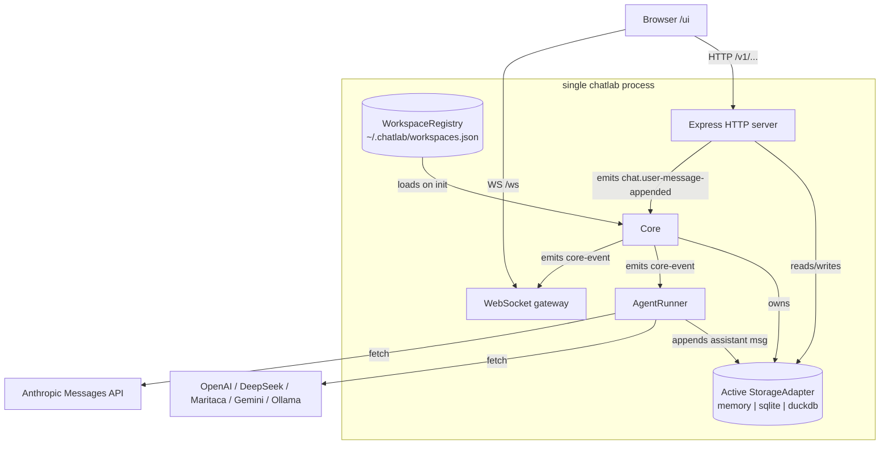
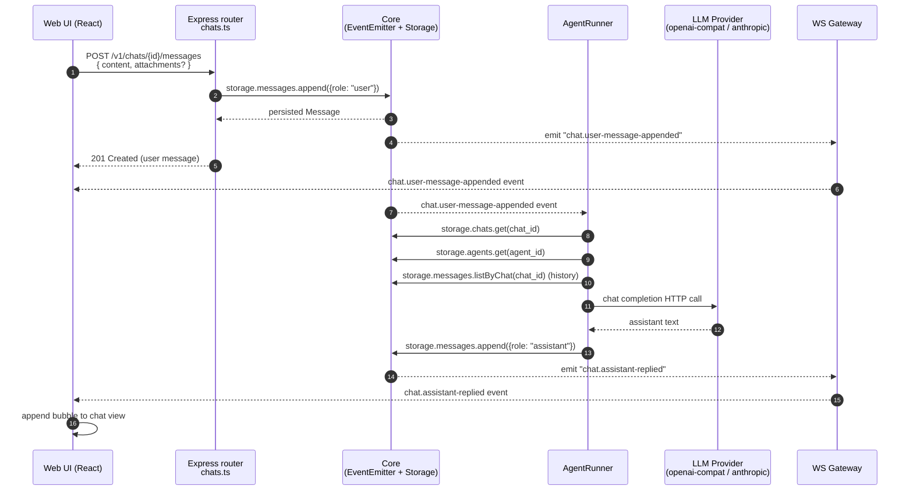
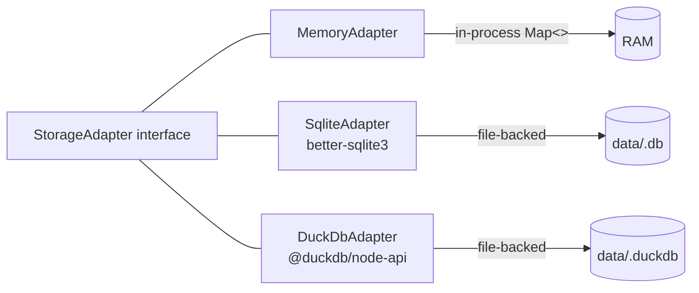

# Architecture

> Status: Implemented for v1.0.0-rc.1.

This document describes how chatlab is wired up. For deeper contracts see [`docs/specs/`](./specs/).

## Big picture



## Process startup

1. **`startChatlab()`** reads CLI flags + env (`CHATLAB_*`), constructs `WorkspaceRegistry`.
2. Registry `init()` either loads an existing `workspaces.json` or auto-creates a `default` sqlite workspace.
3. `Core.start()` opens the active workspace's `StorageAdapter` and binds it to `core.storage`.
4. `AgentRunner` subscribes to `chat.user-message-appended` events.
5. Express app + WS gateway mount; HTTP server starts listening.

## Sequence: user sends a message → assistant replies

The most-walked path through chatlab. The HTTP request returns the persisted user message synchronously; the assistant reply lands asynchronously, broadcast over WebSocket and persisted to the same chat.



Failure paths: a provider 5xx or timeout produces a `chat.assistant-replied` with `status: "failed"` (visible in the bubble) and an `agent.failed` event for the DevDrawer. The runner's `inflight` counter is incremented on entry and decremented on completion regardless of outcome — used by `activateWorkspace` to drain before swapping the adapter.

## Workspace activation (hot-swap)

`POST /v1/workspaces/{id}/activate` triggers:

1. Wait up to 2 s for the runner's `inflight` counter to drain. If not, return `409 ZZ_WORKSPACE_BUSY`.
2. `await currentStorage.close()`.
3. Build a new adapter from the target workspace; `await new.init()`.
4. Atomically rewrite the registry's `active_id`.
5. Emit `workspace.activated`. Connected UIs re-fetch chats / agents.

## Routers

Every HTTP router takes a `Core` reference and uses `core.storage.<namespace>` so it always reads from the currently-active workspace's adapter:

- `workspaces.ts` — registry CRUD + activation
- `chats.ts` — chat CRUD + message append
- `agents.ts` — agent CRUD + probe
- `feedback.ts` — per-message feedback + per-chat annotation + JSONL export
- `media.ts` — media upload + download + delete
- `healthz.ts` — `/healthz`, `/readyz` (unauth)

## Performance characteristics

A skeleton benchmark lives at [`test/perf/storage-bench.test.ts`](https://github.com/jvrmaia/chatlab/blob/main/test/perf/storage-bench.test.ts), default-skipped. Run on demand:

```bash
CHATLAB_TEST_PERF=1 npm test -- test/perf/storage-bench.test.ts
```

It inserts 10 000 messages and reads them back per adapter. The first published numbers will land here when v1.1 closes — until then, the table is intentionally empty so it doesn't drift silently.

| Adapter | Insert total | Insert/row | Read total | Read/row |
| --- | ---: | ---: | ---: | ---: |
| memory | _tbd_ | _tbd_ | _tbd_ | _tbd_ |
| sqlite | _tbd_ | _tbd_ | _tbd_ | _tbd_ |
| duckdb | _tbd_ | _tbd_ | _tbd_ | _tbd_ |

## SLIs (perf targets)

These targets are aspirational for the in-process loop, not service-level guarantees.

| SLI | Target | Note |
| --- | --- | --- |
| `POST /v1/chats/{id}/messages` p99 latency | < 50 ms | persists user message; assistant reply is async |
| Assistant reply round-trip (mock provider) | < 200 ms | runner overhead — excludes provider HTTP time |
| WS event delivery from emit to client | < 50 ms | local network |
| Workspace activation (idle adapter) | < 500 ms | sqlite open + table creation |
| Concurrent chats per process | tested up to 200 | bounded by storage adapter |

## Storage adapters



The interface is identical across all three; the test battery in `test/storage/_battery.ts` runs once per adapter to ensure parity. DuckDB skips the media-binary test due to an upstream `@duckdb/node-api` Buffer-binding limitation.

## Component boundaries

- **`src/types/`** — pure TypeScript types. No runtime code (excluded from coverage).
- **`src/lib/`** — leaf utilities (id generation, time, etc.).
- **`src/storage/`** — persistence interface + 3 implementations.
- **`src/workspaces/`** — registry; persistent metadata above the adapters.
- **`src/core/`** — `Core` class — owns active state, dispatches events.
- **`src/agents/`** — provider HTTP adapters + factory + runner.
- **`src/http/`** — Express routers + middleware.
- **`src/ws/`** — WebSocket gateway, broadcasts core events.
- **`src/ui/`** — React + Tailwind + Vite app served at `/ui`.

## Lifecycles

- **Process**: started by `startChatlab()`, shutdown by `running.stop()` (which closes WS, HTTP, runner, and storage in order).
- **Workspace adapter**: created on activation, closed on the next activation or on process stop.
- **WS connection**: opens on browser load, reconnects with exponential backoff (0.5s → 30s cap) on close.
- **Agent call**: bound to a `chat.user-message-appended` event, runs with a 60 s timeout, increments/decrements the runner's `inflight` counter.

## What's not in this diagram

- **Streaming**: deferred to v1.1.
- **Tool calling**: deferred.
