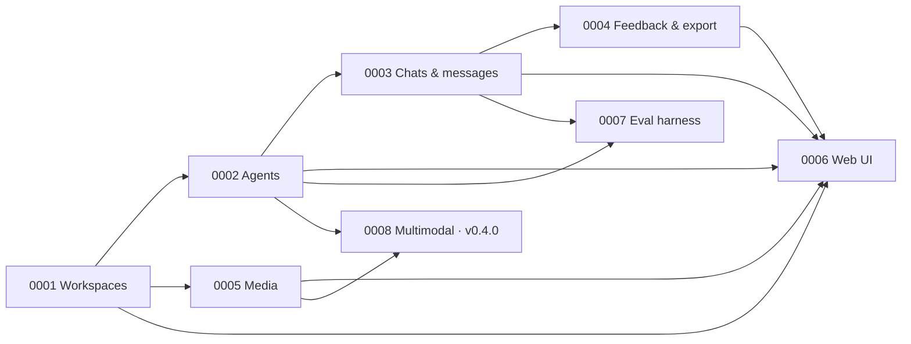

# Roadmap

> chatlab is a **local development platform for chat agents**. v0.1.0 is its first public cut.

This page lists what's shipped and what's next. Dates are absent — milestones move when the work is done.

## Capability dependency graph

## v0.1.0 — First public cut · **Released 2026-05-06 as `v0.1.0`**

**Goal:** workspace-segregated chat-agent development on a laptop. Configure providers, open chats with chosen agents and themes, capture feedback as JSONL.

Capabilities (all `Implemented` as of `v0.1.0`):
- [x] [`0001-workspaces`](./specs/capabilities/0001-workspaces.md) — registry, activation, hot-swap, storage backend selection
- [x] [`0002-agents`](./specs/capabilities/0002-agents.md) — seven providers (six LLM clients + `custom` for the agent under development), masked keys, encrypted at rest, `probe` endpoint
- [x] [`0003-chats-and-messages`](./specs/capabilities/0003-chats-and-messages.md) — chats with `agent_id` + `theme`, async assistant reply
- [x] [`0004-feedback-and-export`](./specs/capabilities/0004-feedback-and-export.md) — 👍/👎 ratings + annotations + JSONL export (`schema_version: 1`)
- [x] [`0005-media`](./specs/capabilities/0005-media.md) — multimodal-ready storage; provider forwarding deferred
- [x] [`0006-web-ui`](./specs/capabilities/0006-web-ui.md) — workspace picker, Chats tab, Admin tab

Distribution: published to npm (`@jvrmaia/chatlab@0.1.0`) and Docker Hub (`jvrmaia/chatlab:0.1.0` / `:latest`) on tag push. **Published documentation site:** [https://jvrmaia.github.io/chatlab/](https://jvrmaia.github.io/chatlab/) (Docusaurus + GitHub Pages — see [ADR 0009](./specs/adr/0009-github-pages-documentation-site.md)).

### TRB reviews — v0.1.0 closeout

Two snapshots framed the GA gate:

- **rc-1 review** ([`docs/reviews/2026-04-30-v1.0.0-rc.1.md`](./reviews/2026-04-30-v1.0.0-rc.1.md)) — maturity 7.0/10; 14 recommendations issued.
- **GA review** ([`docs/reviews/2026-04-30-v1.0.0-ga.md`](./reviews/2026-04-30-v1.0.0-ga.md)) — follow-up snapshot; maturity 7.6/10.

### TRB review — post-security-sprint (v0.1.0)

- **Post-security-sprint review** ([`docs/reviews/2026-05-03-post-security-sprint.md`](./reviews/2026-05-03-post-security-sprint.md)) — full 14-persona snapshot of v0.1.0 after the Dependabot sprint and three HIGH-vulnerability fixes (WS auth bypass, MIME-spoof XSS, SSRF exfiltration). Maturity 7.9/10. Primary findings: SSRF RFC-1918 gap not covered by the blocklist; security-fix regression tests absent; CHANGELOG/SECURITY.md hygiene gaps. 21 action-register items; three flagged for v0.1.x patch.

Action register state at GA tag:

- Five GA blockers (items 1–5) — all **Closed**.
- v0.1.0 soft items 6, 8, 9, 10 — all **Closed**.
- Item 7 (axe-DevTools manual pass) — **Partial**: contrast check shipped ([`axe-contrast-check.md`](./reviews/2026-04-30-axe-contrast-check.md)) with 3 CSS-token findings; manual axe sweep against the live UI still owed and scheduled for `v0.1.1`.
- Items 11–14 — `Spec drafted` / `Skeleton`, all targeting v0.2.0.

A UAT panel of six downstream-role evaluators ([`uat-panel.md`](./reviews/2026-04-30-uat-panel.md)) backlogged 21 user stories, of which items 1–10 anchor the v0.2.0 scope.

## v0.2.1 — Security, tooling, and license · **Released 2026-05-11 as `v0.2.1`**

**Goal:** patch release — no new user-facing capabilities. Addresses security findings from the OSV scanner run, relicenses to EL2, and ships several DX fixes.

- **Elastic License 2.0** — replaces MIT. Source-available; free to use, study, modify, and redistribute. Providing chatlab as a hosted/managed service to third parties requires a commercial agreement.
- **Weekly security sweep** — new `.github/workflows/security-sweep.yml` (CodeQL `security-extended`, OSV-Scanner, Gitleaks, npm audit, license compliance).
- **DuckDB migration fix** — `ALTER TABLE ADD COLUMN` guards added to `init()`, matching `sqlite.ts`. Fixes 500 errors on pre-existing databases.
- **Vite dev HMR fix** — HMR on port 5174; `openWs()` connects directly to `:4480` in dev mode.
- **`npm run dev:all`** — concurrent server + UI dev via `concurrently`.
- **`docs-site` security patches** — HIGH vulnerabilities in `@babel/plugin-transform-modules-systemjs`, `fast-uri`, `fast-xml-builder` resolved.
- **Dependabot** — `@types/node` + 5-package minor-and-patch group updated.

## v0.2.0 — Provider depth + analytics · **Released 2026-05-06 as `v0.2.0`**

Shipped SSE streaming (`POST /v1/chats/{id}/messages` with `Accept: text/event-stream`) and WebSocket auth via `?token=` query parameter. See `CHANGELOG.md` for full notes.

## v0.3.0 — Eval harness

**Goal:** close the development loop for Bruno (solo developer persona). After v0.2.x the core chat/feedback loop is solid; the missing piece is a way to detect regressions when iterating on prompts or swapping providers. This milestone delivers exactly that — nothing else.

Scope:

- **Eval harness** — capability [`0007-eval-harness`](./specs/capabilities/0007-eval-harness.md): golden-set YAML, `chatlab eval --agent <id>` subcommand, Markdown diff report against a baseline. CLI architecture follows [ADR 0015](./specs/adr/0015-cli-subcommand-architecture.md). Tracked from TRB review 2026-05-03 action register item 15.

Milestone closes when: `chatlab eval --agent <id>` runs a 3-prompt golden set, produces a Markdown report, and diffs against a `--baseline`; provider failure exits non-zero without writing a partial report.

## v0.4.0 — Provider depth

**Goal:** unlock multimodal and tool-use agents, give Diego's corpus token metadata, and close the remaining workspace open question. These items share a prerequisite: [ADR 0017](./specs/adr/0017-llm-integration-build-vs-sdk.md) decisions and the SSE extraction to `src/lib/sse.ts`.

Scope:

- **SSE extraction** (`src/lib/sse.ts`) — prerequisite cleanup; eliminates the duplicated `ReadableStreamDefaultReader` loop in `openai-compat.ts` and `anthropic.ts` (per ADR 0017 §Part 3).
- **Adopt `@anthropic-ai/sdk`** for the Anthropic provider (per [ADR 0017](./specs/adr/0017-llm-integration-build-vs-sdk.md)).
- **Multimodal forwarding** — image content parts encoded into the provider's message-array shape (resolves Open Question 1 of [`0005-media`](./specs/capabilities/0005-media.md)).
- **Tool / function calling** — pass tool schemas through to providers that support it; parse `tool_calls` / `tool_use` from responses.
- **Token / cost approximation** — the `agent_message` export shape gains optional `prompt_tokens` / `completion_tokens` / `cost_estimate_usd` fields. Bumps `schema_version` to 2.
- **Workspace duplicate** — clone an existing workspace's data into a new one (re-targeted from v0.2.0; see [`0001-workspaces`](./specs/capabilities/0001-workspaces.md)).

Each new provider capability needs its own capability spec or an update to an existing one before implementation.

## v0.5.0 — Platform adapters

**Goal:** let Bruno distribute his agent through the messaging channels where his users already live. This is a deployment-stage capability, not a development-loop capability — it depends on a stable v0.4.0 API surface.

Scope:

- **Telegram bot adapter** — `POST /v1/adapters/telegram/...` translates Telegram updates into chatlab `Message` and back.
- **Slack Events adapter**.
- **Discord adapter**.
- **WhatsApp Cloud API adapter** — as an adapter, not the central abstraction.

Each adapter is its own capability spec written before implementation. The architecture stays platform-agnostic — adapters are leaves, not the trunk.

## Out of the near-term roadmap

These were considered and pushed to a hypothetical future major release or later:

- **Cloud-hosted workspaces** (sharing across machines / teammates). Local-only by deliberate design — see [ADR 0011](./specs/adr/0011-hosted-instance-deferred.md).
- **Multi-rater workflows / inter-annotator agreement.** The export schema is forward-compatible (one row per `(message_id, rater)` would slot in cleanly), but no UI for it.
- **Agent fine-tuning loops integrated** (export → fine-tune → re-import). chatlab outputs the corpus; what you do with it is your loop.
- **End-user-facing hosting** (`run a chat with my agent at chatlab.io/u/jvrmaia/whatever`). Not the product.

