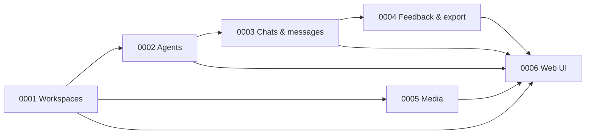

# Roadmap

> chatlab is a **local development platform for chat agents**. v1.0 is its first public cut.

This page lists what's shipped and what's next. Dates are absent — milestones move when the work is done.

## Capability dependency graph

## v1.0 — First public cut · **Released 2026-04-30 as `v1.0.0`**

**Goal:** workspace-segregated chat-agent development on a laptop. Configure providers, open chats with chosen agents and themes, capture feedback as JSONL.

Capabilities (all `Implemented` as of `v1.0.0`):
- [x] [`0001-workspaces`](./specs/capabilities/0001-workspaces.md) — registry, activation, hot-swap, storage backend selection
- [x] [`0002-agents`](./specs/capabilities/0002-agents.md) — seven providers (six LLM clients + `custom` for the agent under development), masked keys, encrypted at rest, `probe` endpoint
- [x] [`0003-chats-and-messages`](./specs/capabilities/0003-chats-and-messages.md) — chats with `agent_id` + `theme`, async assistant reply
- [x] [`0004-feedback-and-export`](./specs/capabilities/0004-feedback-and-export.md) — 👍/👎 ratings + annotations + JSONL export (`schema_version: 1`)
- [x] [`0005-media`](./specs/capabilities/0005-media.md) — multimodal-ready storage; provider forwarding deferred
- [x] [`0006-web-ui`](./specs/capabilities/0006-web-ui.md) — workspace picker, Chats tab, Admin tab

Distribution: published to npm (`chatlab@1.0.0`) and Docker Hub (`jvrmaia/chatlab:1.0.0` / `:latest`) on tag push. **Published documentation site:** [https://jvrmaia.github.io/chatlab/](https://jvrmaia.github.io/chatlab/) (Docusaurus + GitHub Pages — see [ADR 0009](./specs/adr/0009-github-pages-documentation-site.md)).

### TRB reviews — v1.0.0 closeout

Two snapshots framed the GA gate:

- **rc-1 review** ([`docs/reviews/2026-04-30-v1.0.0-rc.1.md`](./reviews/2026-04-30-v1.0.0-rc.1.md)) — maturity 7.0/10; 14 recommendations issued.
- **GA review** ([`docs/reviews/2026-04-30-v1.0.0-ga.md`](./reviews/2026-04-30-v1.0.0-ga.md)) — follow-up snapshot; maturity 7.6/10.

### TRB review — post-security-sprint (v1.1.0)

- **Post-security-sprint review** ([`docs/reviews/2026-05-03-post-security-sprint.md`](./reviews/2026-05-03-post-security-sprint.md)) — full 14-persona snapshot of v1.1.0 after the Dependabot sprint and three HIGH-vulnerability fixes (WS auth bypass, MIME-spoof XSS, SSRF exfiltration). Maturity 7.9/10. Primary findings: SSRF RFC-1918 gap not covered by the blocklist; security-fix regression tests absent; CHANGELOG/SECURITY.md hygiene gaps. 21 action-register items; three flagged for v1.1.x patch.

Action register state at GA tag:

- Five GA blockers (items 1–5) — all **Closed**.
- v1.0 soft items 6, 8, 9, 10 — all **Closed**.
- Item 7 (axe-DevTools manual pass) — **Partial**: contrast check shipped ([`axe-contrast-check.md`](./reviews/2026-04-30-axe-contrast-check.md)) with 3 CSS-token findings; manual axe sweep against the live UI still owed and scheduled for `v1.0.1`.
- Items 11–14 — `Spec drafted` / `Skeleton`, all targeting v1.1.

A UAT panel of six downstream-role evaluators ([`uat-panel.md`](./reviews/2026-04-30-uat-panel.md)) backlogged 21 user stories, of which items 1–10 anchor the v1.1 scope.

## v1.1 — Provider depth + analytics

**Goal:** make the things that matter for serious agent work first-class. Probable scope:

- **Eval harness** — capability [`0007-eval-harness`](./specs/capabilities/0007-eval-harness.md): golden-set YAML, `chatlab eval --agent <id>` subcommand, Markdown diff report. Tracked from TRB review 2026-04-30, item 11.
- **Multimodal forwarding** — image attachments are encoded into the provider's message-array shape (resolves Open Question 1 of [`0005-media`](./specs/capabilities/0005-media.md)).
- **Streaming responses (SSE)** — `text/event-stream` support in `POST /v1/chats/{id}/messages` so the UI fills the assistant bubble incrementally.
- **Tool / function calling** — pass tool schemas through to providers that support it.
- **Token / cost approximation** — the `agent_message` export shape gains optional `prompt_tokens` / `completion_tokens` / `cost_estimate_usd` fields. Bumps `schema_version` to 2.
- **Workspace duplicate** — clone an existing workspace's data into a new one (resolves Open Question 2 of [`0001-workspaces`](./specs/capabilities/0001-workspaces.md)).

Note: the **public docs site** ([ADR 0009](./specs/adr/0009-github-pages-documentation-site.md)) shipped alongside v1.0 rather than waiting for this milestone.

## v1.2+ — Platform adapters

**Goal:** chatlab agents speak natively to real chat platforms. Probable order:

- **Telegram bot adapter** — `POST /v1/adapters/telegram/...` translates Telegram updates into chatlab `Message` and back.
- **Slack Events adapter**.
- **Discord adapter**.
- **WhatsApp Cloud API adapter** — yes, this is back, but as an *adapter*, not the central abstraction. Closes the loop with the audience the project's earliest iteration aimed at.

Each adapter is its own capability spec. The architecture stays platform-agnostic — adapters are leaves, not the trunk.

## Out of the v1.x roadmap

These were considered and pushed to a hypothetical v2 or later:

- **Cloud-hosted workspaces** (sharing across machines / teammates). Local-only by deliberate design — see [ADR 0011](./specs/adr/0011-hosted-instance-deferred.md).
- **Multi-rater workflows / inter-annotator agreement.** The export schema is forward-compatible (one row per `(message_id, rater)` would slot in cleanly), but no UI for it.
- **Agent fine-tuning loops integrated** (export → fine-tune → re-import). chatlab outputs the corpus; what you do with it is your loop.
- **End-user-facing hosting** (`run a chat with my agent at chatlab.io/u/jvrmaia/whatever`). Not the product.

