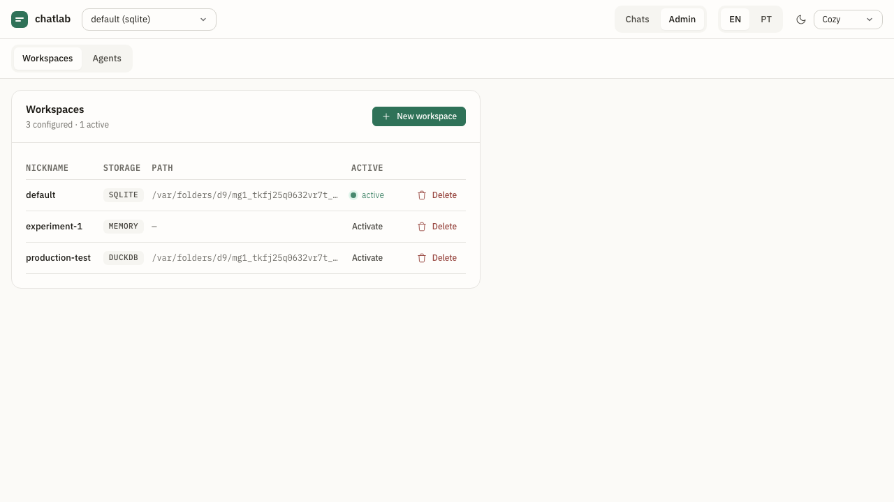

# 0001 — Workspaces

- **Status:** Implemented (v1.0.0)
- **Authors:** @jvrmaia
- **Related ADRs:** [`0006-persistence-engines`](../adr/0006-persistence-engines.md)
- **Depends on:** _none — foundational_

## Summary

A **workspace** is a named, segregated environment owned by chatlab. It carries a UUID, a user-facing nickname, and a storage backend (`memory`, `sqlite`, or `duckdb`). All chats, agents, messages, feedback, and annotations live inside one workspace. The user runs many workspaces but operates on **one at a time** — switching is explicit and preserves the other workspaces' state.



## Motivation

A chat-agent developer commonly runs several scenarios in parallel: "the support-bot we're shipping next week", "the experimental hot-take agent", "a clean SQLite for the integration test suite", "a DuckDB workspace where I can run analytical queries against the corpus". Workspaces let those scenarios coexist in one chatlab process, each with its own storage backend, and a single `POST /v1/workspaces/{id}/activate` swaps which one is in effect without restarting.

Workspaces solve that. Create as many as you want, each with its own data files, switch at runtime via the UI or HTTP, and the data you weren't using a moment ago is still there when you switch back.

## User stories

- As a **chat-agent developer**, I want to keep separate workspaces for "production-like" scenarios and "throwaway experiments", so that I never accidentally rate or annotate test data into the corpus I care about.
- As a **chat-agent developer running CI**, I want to spin up a fresh `memory` workspace per test run, so that scenarios don't leak across runs.
- As a **chat-agent developer doing analytics**, I want a DuckDB-backed workspace alongside my day-to-day SQLite one, so that I can run analytical queries against the feedback corpus without hurting day-to-day write latency.
- As a **chat-agent developer**, I want to switch workspaces from the UI without losing the workspace I was in, so that I can flip between "what I was doing" and "what I want to compare it to".

## Behavior

### Registry

- chatlab MUST persist a **registry** as a single JSON file at `$CHATLAB_HOME/workspaces.json` (default `~/.chatlab/workspaces.json`). The registry is process-global; storage adapters per workspace live alongside it (e.g. `~/.chatlab/data/<uuid>.db`).
- The registry's shape:
  ```json
  {
    "active_id": "uuid-1",
    "workspaces": [
      { "id": "uuid-1", "nickname": "default", "storage_type": "sqlite",
        "storage_path": "~/.chatlab/data/uuid-1.db",
        "created_at": "2026-04-29T10:00:00Z", "updated_at": "..." }
    ]
  }
  ```
- The registry MUST be writable atomically — write to `workspaces.json.tmp` then `rename` over the original — so a crash mid-write doesn't corrupt it.

### Bootstrapping

- On startup, if the registry file is missing, chatlab MUST auto-create a workspace named `default` with `storage_type: "sqlite"` and mark it active. This guarantees the user always has *something* to operate on without a setup step.
- CLI flag `--workspace=<id>` overrides the registry's `active_id` for the running process. If the id doesn't exist, the activation throws `ZZ_WORKSPACE_NOT_FOUND` and the process exits with the runtime's standard `1`.
- Env var `CHATLAB_WORKSPACE_ID` follows the same semantics, lower priority than the flag.

### CRUD endpoints

All under `/v1/workspaces/...`. See [`../api/openapi.yaml`](../api/openapi.yaml) for shapes.

- `POST /v1/workspaces` creates a workspace. Required: `nickname`, `storage_type`. Returns 201 with the new record.
- `GET /v1/workspaces` lists every workspace.
- `GET /v1/workspaces/{id}` returns one or 404.
- `PATCH /v1/workspaces/{id}` updates **only the nickname**. `storage_type` and `storage_path` are immutable post-create — changing them would mean migrating data.
- `DELETE /v1/workspaces/{id}?confirm=true` removes the workspace from the registry **and deletes its data file** (sqlite/duckdb). Refuses without `confirm=true` (returns 400). If the deleted workspace was active, chatlab MUST set `active_id` to another workspace; if none remain, it MUST auto-create `default` again.
- `GET /v1/workspaces/active` returns the currently-active workspace.

### Activation (hot-swap)

- `POST /v1/workspaces/{id}/activate` switches the running adapter:
  1. Wait up to **2 seconds** for the AgentRunner's in-flight counter to drain. If it doesn't, return 409 with `error_subcode: "ZZ_WORKSPACE_BUSY"`.
  2. `await currentStorage.close()`.
  3. Instantiate adapter for the target workspace; `await new.init()`.
  4. Update `active_id` in the registry (atomic write).
  5. Broadcast a `workspace.activated` event over the WebSocket gateway carrying the new workspace's id + nickname.
  6. Return the new active workspace record.
- Activation is **idempotent** — activating the already-active workspace is a no-op that returns 200.

### Auth

- Same Bearer-token guard as every other endpoint: `Authorization: Bearer <token>`. `CHATLAB_REQUIRE_TOKEN=hunter2` enforces a specific token.

## Out of scope

- **Renaming `storage_type` post-create** — would require an export/import migration. Future capability.
- **Cross-workspace queries / data joins** — every workspace is an island in v1.0.
- **Cloud-hosted workspaces** (sharing across machines) — local-only by design. Captured in [ADR 0011](../adr/0011-hosted-instance-deferred.md) as deferred.
- **Workspace-level access control** (read-only mode, per-workspace tokens) — auth is process-level only.
- **Backup / snapshot** — out of scope for v1.0; users manage their own `~/.chatlab/data/` files.

## Open questions

1. Should `DELETE` also support `?confirm=<workspace-uuid>` as a typed-confirm pattern (you must paste the UUID), à la GitHub repo deletion? **Decision target:** v1.1 if anyone reports an accidental delete.
2. The `~/.chatlab/data/<uuid>.db` path — should it be configurable per workspace at create time, or is "always under `$CHATLAB_HOME/data/`" enough?

(The earlier "workspace duplicate" open question is resolved: scheduled for v1.1 per [`ROADMAP.md`](../../ROADMAP.md#v11--provider-depth--analytics).)

## Verification

- [ ] On a fresh machine with no `~/.chatlab` dir, start chatlab. Confirm a `default` workspace + sqlite db file are created.
- [ ] `POST /v1/workspaces` creates `experiment-1`. `GET /v1/workspaces` lists both. `POST /v1/workspaces/{experiment-1-id}/activate` swaps. `GET /v1/workspaces/active` reflects the swap.
- [ ] Send a message in `experiment-1`. Switch back to `default`. The message isn't visible. Switch to `experiment-1` again — it's still there.
- [ ] `DELETE /v1/workspaces/{id}` without `?confirm=true` returns 400. With `?confirm=true` removes the row and deletes the data file.
- [ ] Delete the currently-active workspace; confirm `active_id` switches to another workspace and the UI receives a `workspace.activated` event.

## Acceptance

- **Vitest test ID(s):** `test/workspaces/registry.test.ts` (registry CRUD + atomic write); `test/http/workspaces-router.test.ts` (HTTP surface + activate + ?confirm guard).
- **OpenAPI operation(s):** `listWorkspaces`, `createWorkspace`, `getActiveWorkspace`, `activateWorkspace`, `patchWorkspace`, `deleteWorkspace` in [`openapi.yaml`](../api/openapi.yaml).
- **User Guide section:** [`docs/user-guide/02-workspaces-and-agents.md`](/user-guide/workspaces-and-agents).
