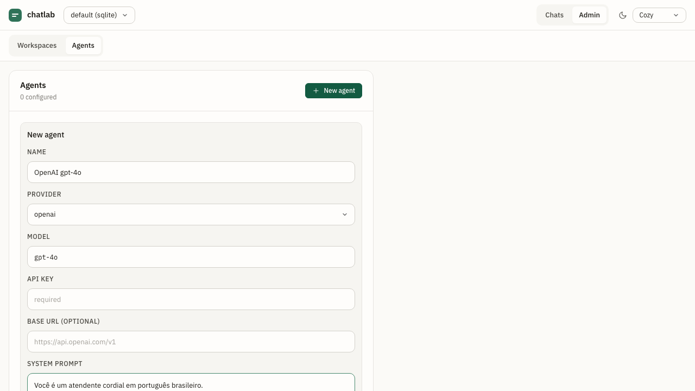

# 0002 — Agents

- **Status:** Implemented (v1.0.0)
- **Authors:** @jvrmaia
- **Related ADRs:** _none_
- **Depends on:** [`0001-workspaces`](./0001-workspaces.md)

## Summary

An **agent** is a configured connection to an LLM provider — or to **the agent under development**. It carries a name, a provider identifier (`openai | anthropic | deepseek | gemini | maritaca | ollama | custom`), a model string, an optional API key (encrypted at rest), an optional system prompt, and a context window. Agents are scoped to a workspace — you have as many as you want, you assign one per chat at chat creation time. Seven providers ship out of the box; two HTTP adapters cover all of them: `anthropic` for Anthropic's native shape, `openai-compat` for the rest (including `custom`, which is the headline use case — pointing chatlab at the agent the developer is building).



## Motivation

The pre-pivot built-in agent runner had a single global "default" agent that auto-replied to every inbound message. Useful for the simplest demo, useless for any real testing — you want to compare two providers, run the same scenario against three different system prompts, or pin a specific model to a chat without affecting the rest. Per-workspace agent profiles + per-chat assignment unlocks all of that without adding ceremony.

## User stories

- As a **chat-agent developer**, I want to configure OpenAI gpt-4o, Anthropic claude-sonnet-4-6, and a local Ollama llama3 in the same workspace, so that I can flip between them per chat.
- As a **chat-agent developer**, I want to verify my API key works without sending a real message, so that I can fix configuration issues fast.
- As a **chat-agent developer**, I want my API keys to never appear in any HTTP response or feedback export, so that an accidental screenshot or corpus paste doesn't leak them.
- As an **air-gapped hobbyist**, I want to use Ollama at `http://localhost:11434/v1` with no API key, so that I can iterate fully offline.

## Behavior

### Provider list

chatlab MUST support exactly these six provider identifiers:

| Provider | Adapter | Default base URL | Default model | Requires API key |
| --- | --- | --- | --- | --- |
| `openai` | openai-compat | `https://api.openai.com/v1` | `gpt-4o` | yes |
| `anthropic` | anthropic | `https://api.anthropic.com` | `claude-sonnet-4-6` | yes |
| `deepseek` | openai-compat | `https://api.deepseek.com` | `deepseek-chat` | yes |
| `gemini` | openai-compat | `https://generativelanguage.googleapis.com/v1beta/openai` | `gemini-2.5-flash` | yes |
| `maritaca` | openai-compat | `https://chat.maritaca.ai/api` | `sabia-3` | yes |
| `ollama` | openai-compat | `http://localhost:11434/v1` | `llama3` | no |

Five providers share the OpenAI-compatible adapter (`POST {base_url}/chat/completions` with Bearer auth, parses `choices[0].message.content`); Anthropic uses a distinct adapter (`POST {base_url}/v1/messages` with `x-api-key` + `anthropic-version`, hoists the system prompt to the top-level `system` field, parses `content[0].text`).

### Profile fields

```ts
interface Agent {
  id: string;                                              // UUID
  workspace_id: string;
  name: string;
  provider: AgentProvider;
  model: string;                                           // free-text — accept new models without an emulator release
  api_key?: string;                                        // masked in HTTP responses
  base_url?: string;                                       // overrides provider default
  system_prompt?: string;
  context_window: number;                                  // default 20
  created_at: string;
  updated_at: string;
}
```

Two flags from the pre-pivot model are gone: `is_default`, `auto_reply`. There is no global default — the chat picks the agent at creation. There is no auto-reply toggle — when an agent is assigned to a chat, it auto-replies to every user message in that chat. To "pause" an agent, the user just stops sending messages.

### CRUD endpoints

All under `/v1/agents/...`. Operate on the **active** workspace.

- `POST /v1/agents` creates a profile. Required: `name`, `provider`, `model`. Returns 201 with the masked record.
- `GET /v1/agents` lists. API keys masked.
- `GET /v1/agents/{id}` reads one or 404. API key masked.
- `PATCH /v1/agents/{id}` partial update. Omitting `api_key` preserves the stored value.
- `DELETE /v1/agents/{id}` removes. If any chat references the agent, the delete returns 409 — the user must delete the dependent chats first. (No cascading deletes; the data anchored to those chats is too valuable to lose silently.)
- `POST /v1/agents/{id}/probe` runs a one-shot provider call (`{ prompt }` → `{ content }`). Independent of any chat. Used by the UI's **Probe** button.

### Masking

- API keys MUST be masked as `***last4` in every HTTP response (e.g. `***wxyz`).
- API keys MUST NEVER appear in the JSONL feedback export.
- API keys are stored **plaintext** in the underlying adapter (sqlite/duckdb file, in-memory map). Adopters with strict requirements should run chatlab on encrypted disk — encryption-at-rest is out of scope.

### Auth

Same Bearer guard as every other endpoint.

## Out of scope

- **Per-agent timeout / temperature in the API.** Defaults: 60 s, 0.7. Hardcoded for v1.0.
- **Streaming responses (SSE).** The runner buffers the full provider response before persisting.
- **Tool / function calling.** The messages array is plain text only.
- **Multimodal input** to providers. Even though the workspace stores media, the runner does not forward images / audio to the provider in v1.0. Future capability.
- **Cost / token tracking.** Provider dashboards are the source of truth.
- **Encryption-at-rest** of API keys.

## Open questions

1. Should `DELETE` cascade to dependent chats with `?cascade=true`? Currently 409 with no escape hatch beyond manual delete. **Decision target:** depends on user pain.

(The earlier "should `agent_version` be auto-populated as `<provider>:<model>`?" question is **resolved**: yes, the feedback export does this — see [`0004-feedback-and-export`](./0004-feedback-and-export.md) and `src/http/routers/feedback.ts`.)

## Verification

- [ ] Create a profile with `provider: ollama`, `model: llama3`, leave `api_key` blank. `GET /v1/agents` returns the profile with `api_key` absent.
- [ ] Create a profile with `provider: openai`, `model: gpt-4o`, `api_key: sk-fake-1234567890ABCDwxyz`. `GET` returns `api_key: "***wxyz"` (HTTP masking). The plaintext key never appears in any list response, and the on-disk row stores ciphertext (`enc:v1:...`) — see [`SECURITY.md`](https://github.com/jvrmaia/chatlab/blob/main/SECURITY.md#at-rest-encryption).
- [ ] `PATCH /v1/agents/{id}` with `{ name: "renamed" }` keeps `api_key` intact. `PATCH` with `api_key: ""` is a no-op (does not clear). To clear, the user must `DELETE` and recreate.
- [ ] `POST /v1/agents/{id}/probe` with `{ prompt: "Olá" }` returns `{ content: "..." }`. With a wrong API key, returns 502 + `error_subcode: ZZ_AGENT_PROVIDER_ERROR`.
- [ ] `DELETE /v1/agents/{id}` while a chat references it returns 409. After deleting the dependent chats, `DELETE` succeeds.
- [ ] Switch workspace and confirm the agent list is per-workspace (the previous workspace's agents don't appear).

## Acceptance

- **Vitest test ID(s):** `test/agents/openai-compat.test.ts`, `test/agents/anthropic.test.ts` (provider adapters); `test/http/agents-router.test.ts` (CRUD + probe + 409); `test/storage/encryption.test.ts` (api_key at-rest encryption).
- **OpenAPI operation(s):** `listAgents`, `createAgent`, `getAgent`, `patchAgent`, `deleteAgent`, `probeAgent` in [`openapi.yaml`](../api/openapi.yaml).
- **User Guide section:** [`docs/user-guide/02-workspaces-and-agents.md`](../../user-guide/02-workspaces-and-agents.md) plus [`docs/providers.md`](../../providers.md).
