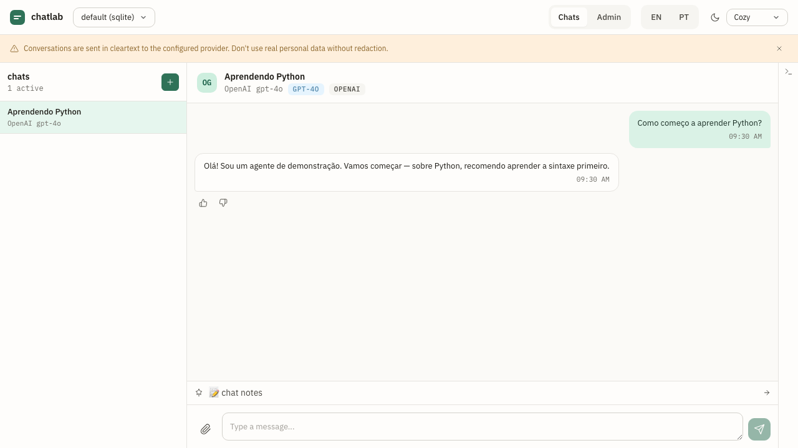

# 0003 — Chats and messages

- **Status:** Implemented (v1.0.0)
- **Authors:** @jvrmaia
- **Related ADRs:** _none_
- **Depends on:** [`0001-workspaces`](./0001-workspaces.md), [`0002-agents`](./0002-agents.md)

## Summary

A **chat** is a single conversation between the developer (role `user`) and one chosen agent (role `assistant`), pinned to a free-text **theme** for context segregation. The user appends messages; the agent runner replies asynchronously. Multiple chats with the same agent on different themes coexist without context bleed because each chat carries its own UUID and message history.



## Motivation

The pre-pivot model had personas, direct-vs-group chat types, status state machines (sent → delivered → read → failed), and a Cloud-API-shaped envelope. None of it was actually useful for chat-agent dev. The v1.0 model strips that down to the minimum that lets you (a) talk to an agent, (b) keep multiple parallel topics straight, (c) segregate context.

The **theme** field is the key innovation: a free-text topic injected as system context. Two chats with the same agent on different themes will carry independently — the agent sees only the chat-scoped history plus the theme, never the other chat's content.

## User stories

- As a **chat-agent developer**, I want to open one chat with the support agent on theme "Aprendendo Python" and another chat with the same agent on theme "Receitas culinárias", and have them stay perfectly segregated, so that I can compare how the agent handles unrelated topics without re-prompting.
- As a **chat-agent developer**, I want to type messages in the UI and see the agent reply within a couple of seconds, with no extra setup beyond having the agent profile configured.
- As a **chat-agent developer**, I want failed agent calls to surface inline on the bubble (with the error message visible) instead of crashing the chat, so that I can see provider-side issues immediately.

## Behavior

### Domain shape

```ts
interface Chat {
  id: string;                                              // UUID
  workspace_id: string;
  agent_id: string;                                        // fixed for the chat's lifetime
  theme: string;                                           // free-text, ≤ 280 chars
  created_at: string;
  updated_at: string;
}

interface Message {
  id: string;                                              // UUID
  chat_id: string;
  role: "user" | "assistant";
  content: string;                                         // plain text; ≤ 16 KB
  attachments?: Array<{                                    // see capability 0005
    media_id: string;
    mime_type: string;
    filename?: string;
  }>;
  status: "ok" | "failed";
  error?: string;                                          // when status=failed (LlmError message)
  created_at: string;
}
```

What the pre-pivot model had and v1.0 dropped:
- `direction: "inbound" | "outbound"` → replaced by `role: "user" | "assistant"`.
- `status: "sent" | "delivered" | "read" | "failed"` and the state machine → simplified to `ok | failed`. No transitions, no history.
- `from: WaId` → not stored; the chat owns the relationship.
- `timestamp` and `status_history` → consolidated into a single `created_at`.
- `body` → renamed `content`.
- `media_id`, `filename`, `mime_type` (top-level) → moved into `attachments[]`.

### CRUD

All under `/v1/chats/...`. Operate on the active workspace. See [`../api/openapi.yaml`](../api/openapi.yaml).

- `POST /v1/chats` creates a chat. Required: `agent_id` (must exist in the active workspace), `theme`. Returns 201.
- `GET /v1/chats` lists, ordered by `updated_at DESC`.
- `GET /v1/chats/{id}` reads one.
- `DELETE /v1/chats/{id}` removes the chat + all its messages + any feedback rows + its annotation. Cascading delete is the expected semantic — the data is conversation-scoped.
- `GET /v1/chats/{id}/messages` returns the chat's messages oldest-first by `created_at`. (Pagination — `limit` / `before` query params — is deferred to v1.1.)

### Sending a message

`POST /v1/chats/{id}/messages` with body `{ content, attachments? }`:

1. Server appends a `user`-role message synchronously and returns 201 with the persisted message.
2. The AgentRunner picks up a `chat.user-message-appended` event, resolves `chat.agent_id`, builds the messages array, calls the provider with a 60 s timeout, and persists an `assistant`-role message with `status: "ok"` (or `failed` on `LlmError`).
3. The UI receives the assistant reply via the WS broadcast (`chat.assistant-replied`) or by polling `GET /v1/chats/{id}/messages`.

The HTTP response of `POST /messages` does **not** wait for the assistant reply. The user message is the only thing the request commits to. Treating the assistant reply as async lets the UI render the user bubble immediately and fill in the assistant bubble when it arrives — no perceived latency on the typing-feedback loop.

### Building the messages array (runner)

```
[
  { role: "system",
    content: agent.system_prompt
              ? agent.system_prompt + "\n\nTopic of this conversation: " + chat.theme
              : "Topic of this conversation: " + chat.theme },
  ...last `agent.context_window` messages of this chat (oldest first),
]
```

The just-appended user message is included in the last-N window. Only `role: "user" | "assistant"` messages are sent — no system messages from history.

### Error handling

- Provider 4xx / 5xx → `LlmError` with `subcode: "ZZ_AGENT_PROVIDER_ERROR"`. The runner persists an assistant message with `status: "failed"` and `error: <message>`. The chat stays open; subsequent user messages still trigger the runner.
- Timeout (60 s) → `LlmError` with `subcode: "ZZ_AGENT_TIMEOUT"`. Same handling.
- Missing API key on a provider that requires one → fail-fast before fetch. The `assistant` message records `status: "failed"` so the UI surfaces the misconfiguration inline.

### Concurrency

- A workspace activation (`POST /v1/workspaces/{id}/activate`) waits for the AgentRunner's in-flight counter (per [`0001-workspaces`](./0001-workspaces.md)) to drain. Sending a user message during a swap doesn't lose data — the swap waits up to 2 s; if it can't drain, it returns 409.

## Out of scope

- **Streaming responses.** Future capability.
- **Editing messages** post-send. Append-only.
- **Multi-agent / round-table chats.** A chat has exactly one assistant agent.
- **Switching the agent on an existing chat.** `agent_id` is fixed at creation. To compare, create another chat.
- **Public/shareable chats.** Local-only.
- **Search across chats.** v1.1+.

## Open questions

1. Should the `POST /messages` response include a hint about whether the runner has been kicked off (e.g. `pending_assistant: true`)? Or is that an over-promise, since the runner could fail before producing anything? **Likely answer:** include it, but only as a hint; the UI relies on the WS event for the actual reply.
2. Should very long chats auto-truncate the `context_window` differently (sliding window, summarization)? v1.0 just drops anything past N. **Decision target:** v1.1 if anyone reports degradation.

(The earlier "should `theme` be optional?" question is **resolved**: theme is required, enforced at `POST /v1/chats` with a non-empty-string validation.)

## Verification

- [ ] Create two chats with the same agent + different themes. Send a topic-specific question in each. Confirm the assistant replies stay topical to each chat's theme without bleeding.
- [ ] Send a message to a chat whose agent has a wrong API key. Confirm an assistant bubble appears with `status: failed` and the upstream error visible. Confirm a subsequent message (after fixing the key) succeeds.
- [ ] Create a chat. Delete it. Confirm `GET /v1/chats/{id}/messages` returns 404 and any feedback / annotation rows for it are gone.
- [ ] Confirm the messages array sent to the provider includes the system prompt + theme + last N messages of the chat — but **not** any messages from sibling chats. (Inspectable via DevDrawer or via mock provider in tests.)
- [ ] Activate a different workspace mid-conversation; confirm the chat list reflects the new workspace's chats and the previous workspace's data is intact when switched back.

## Acceptance

- **Vitest test ID(s):** `test/http/chats-router.test.ts` (CRUD + message append + assistant reply integration); `test/agents/runner.test.ts` (RUN-01 happy path, RUN-02 provider error); `test/agents/runner-swap.test.ts` (RUN-SWAP-01 — workspace swap during in-flight reply).
- **OpenAPI operation(s):** `listChats`, `createChat`, `getChat`, `deleteChat`, `listChatMessages`, `appendUserMessage` in [`openapi.yaml`](../api/openapi.yaml).
- **User Guide section:** [`docs/user-guide/03-chats-and-messages.md`](/user-guide/chats-and-messages) and [`docs/user-guide/04-multiple-chats.md`](/user-guide/multiple-chats).
