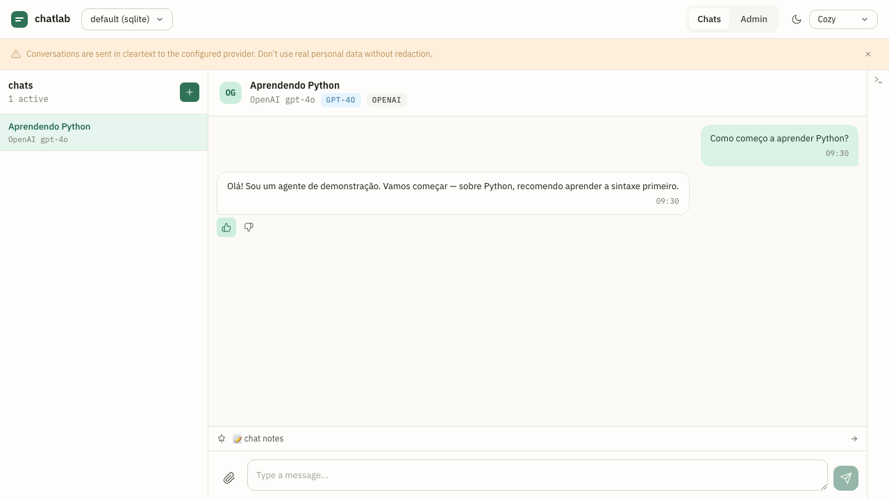

# 0004 — Feedback and export

- **Status:** Implemented (v1.0.0)
- **Authors:** @jvrmaia
- **Related ADRs:** [`0007-feedback-corpus-model`](../adr/0007-feedback-corpus-model.md)
- **Depends on:** [`0003-chats-and-messages`](./0003-chats-and-messages.md)

## Summary

Every assistant message can be rated 👍 or 👎 (with an optional comment) directly from the UI. Every chat carries a free-text Markdown **annotation** for conversation-level notes. Both signals are exportable as JSONL — one line per rated message — feeding RLHF / DPO / SFT pipelines without a separate annotation tool.



## Motivation

Capturing pairwise preference (👍 / 👎) on agent replies, alongside chat-level free-text annotations, gives the developer a fine-tuning-ready corpus without adopting a separate annotation tool. The shape decisions (single-rater per row, JSONL streaming, schema-version pinning, optional `agent_version` / `failure_category` / `flagged_for_review` fields) are locked in [ADR 0007](../adr/0007-feedback-corpus-model.md) so the data captured today stays interoperable with future runs. v1.0 publishes `schema_version: 1`. Only `role: assistant` messages are rateable; `prompt_message` in the export points at the previous `user` message in the same chat.

## User stories

- As a **chat-agent developer**, I want to thumbs-up the agent's reply when it nails my test scenario, so that the dataset I export later includes "this is the kind of answer I want".
- As a **PM / non-developer tester**, I want to rate replies with one click, so that I produce training data without learning a new tool.
- As an **MLE**, I want the export to carry the `agent_version` (auto-populated as `<provider>:<model>` when known) so I can `GROUP BY` it before computing aggregates.
- As a **chat-agent developer**, I want to write a paragraph of notes per chat (theme-level context), so that I can come back to review patterns.

## Behavior

### Per-message feedback

- Every `role: assistant` message is rateable. `role: user` messages are not — they're inputs, not outputs.
- A rating is `up`, `down`, or *absent*. The HTTP API is set/read/clear (`POST`, `GET`, `DELETE` on `/v1/messages/{id}/feedback`). `POST` overwrites any prior rating with the new value; `DELETE` clears.
- The Web UI surfaces the rating as a toggle: tapping the already-active 👍 sends `DELETE` (clears); tapping the opposite affordance sends `POST` (replaces). The toggle is a UI affordance — the HTTP API itself does not auto-clear on a duplicate `POST`.
- Optional comment (≤ 280 chars) is a string field. Cleared rating clears the comment.
- `POST { rating: null }` is rejected (use `DELETE`).
- Bulk read: `GET /v1/chats/{chat_id}/feedback` returns `{ data: [...] }` always 200 — the UI uses this for one round-trip to render all 👍/👎 state across the chat.

### Conversation-level annotations

- One free-text Markdown annotation per **chat**. Up to 16 KB.
- Last-write-wins (PUT semantics).
- `GET /v1/chats/{chat_id}/annotation` returns `{ chat_id, body, updated_at }` always 200 — `body: ""`, `updated_at: null` if never written. Avoids 404 noise in the UI.

### Retention

- `CHATLAB_FEEDBACK_RETENTION_DAYS` (default **90 days**) is read on startup and printed in the banner. `Core.startRetentionSweep` installs a daily timer (24 h) that calls `adapter.feedback.sweepOlderThan(cutoff)` + `adapter.annotations.sweepOlderThan(cutoff)` for the active workspace; each sweep emits a structured log line via the pino logger.
- `0` disables retention; the timer is not installed and the banner says `DISABLED — never sweeps`.
- The exposed methods (`sweepOlderThan` on both namespaces, `Core.runRetentionSweep` on the active workspace) stay public for callers that want a manual sweep on-demand.

### Export

- `GET /v1/feedback/export` streams JSONL (`Content-Type: application/x-ndjson`).
- Filters: `since`, `until`, `rating`, `chat_id`.
- Every line:
  ```json
  {
    "schema_version": 1,
    "workspace_id": "...",
    "chat_id": "...",
    "theme": "Aprendendo Python",
    "agent_message": { "id": "...", "created_at": "...", "content": "..." },
    "prompt_message": { "id": "...", "role": "user", "created_at": "...", "content": "..." },
    "rating": "up",
    "comment": "nailed it",
    "rated_at": "...",
    "annotation": "user kept rephrasing — agent ignored the order id",
    "agent_version": "openai:gpt-4o",
    "failure_category": "wrong_intent",
    "flagged_for_review": false
  }
  ```
- `agent_version` is auto-populated as `<provider>:<model>` from the chat's agent (resolves [Open Question 2](#open-questions) of capability 0002 in the affirmative for the export, while keeping the field opaque elsewhere).
- API keys and base URLs of agents MUST NEVER appear in the export.

## Out of scope

- **Per-message annotations.** Annotation is per-chat only. Multi-rater workflows postponed.
- **Auto-suggesting replacement responses.** Captures human signal; downstream pipelines do whatever they want with it.
- **Pushing feedback to an external label store** (Argilla, Label Studio).
- **Auto-redaction of PII in comments / annotations.** Documented in [`docs/legal/data-handling.md`](../../legal/data-handling.md).

## Open questions

1. Should `agent_version` in the export be customizable (override the auto-populated `<provider>:<model>` with a user-supplied value)? Useful when shipping a fine-tune named `support-bot-v3.2` that doesn't show up in `model`. Currently no override.
2. Should there be a "flag for review" affordance in the UI that sets `flagged_for_review: true`? The export field exists but the UI doesn't surface it in v1.0.

## Verification

- [ ] Send an assistant message via a chat. Rate it 👍 from the UI. `GET /v1/messages/{id}/feedback` returns `{ rating: "up", ... }`.
- [ ] Rate it 👎 — the previous up-rating is replaced.
- [ ] Tap 👎 a second time — the UI sends `DELETE`; `GET` then returns 404.
- [ ] `DELETE /v1/messages/{id}/feedback` directly — same end-state.
- [ ] PUT an annotation on a chat. Reload the UI — annotation persists.
- [ ] `GET /v1/feedback/export?rating=down` streams JSONL with `schema_version: 1`. Confirm `agent_version` reflects the chat's agent's `<provider>:<model>`.
- [ ] Try to rate a `role: user` message — returns 400 with `error_subcode: "ZZ_NOT_RATEABLE"`.
- [ ] Switch workspace; confirm export only includes the active workspace's data.

## Acceptance

- **Vitest test ID(s):** `test/http/feedback-router.test.ts` (rating CRUD, annotation PUT semantics, JSONL export shape, 404 on cleared rating); `test/core/retention.test.ts` (sweep behaviour).
- **OpenAPI operation(s):** `setFeedback`, `getFeedback`, `clearFeedback`, `listChatFeedback`, `getAnnotation`, `setAnnotation`, `exportFeedback` in [`openapi.yaml`](../api/openapi.yaml).
- **User Guide section:** [`docs/user-guide/05-feedback-and-export.md`](../../user-guide/05-feedback-and-export.md) and [`docs/exporting-feedback.md`](../../exporting-feedback.md).
